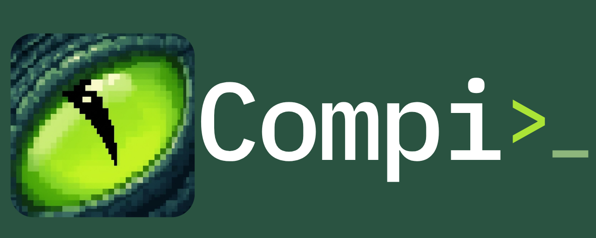
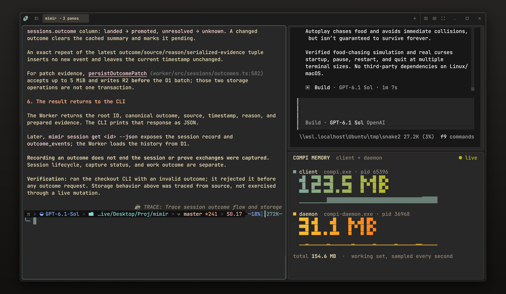

# Compi

[](https://github.com/cloudboy-jh/compi/actions/workflows/core-ci.yml)

Compi is a native terminal workspace for Windows and macOS.



- Shells keep running when you close the window.
- Workspaces, tabs, and split panes.
- Floating terminals and layout presets.
- Shell prompt styles from Oh My Posh or Starship.
- Remote connections over SSH.
- Themes, fonts, and appearance settings.

## Download

Get Compi from [GitHub Releases](https://github.com/cloudboy-jh/compi/releases).

- **Windows:** x64, with WSL2 required. Use the installer or extract the complete portable archive.
- **macOS:** Apple Silicon, macOS 14+. Move the complete app into Applications. Native workspace qualification remains open.

Windows builds are unsigned and macOS builds are ad-hoc signed unless publisher credentials are configured; OS trust warnings may appear. Linux has a headless server, but its graphical client is not yet qualified.

## Development

Requires Rust and platform build tools. Windows also needs WSL2 and PowerShell 7; macOS needs Xcode with the Metal compiler.

On Windows, prepare the bundled terminal runtime first:

```bash
pwsh -File tools/prepare-conpty.ps1
```

Then start the isolated development preview:

```bash
cargo dev
```

Client edits rebuild and relaunch the preview while its shells keep running. Explicit daemon restarts end dev shells. See the [development guide](docs/DEVELOPMENT.md) for controls and cleanup scope.

Run tests:

```bash
cargo test --locked -p compi-protocol -p compi-daemon -p compi-client -p compi-dev
```

## Documentation

- [Usage and SSH](docs/USAGE.md)
- [Appearance and configuration](docs/CONFIGURATION.md)
- [Development](docs/DEVELOPMENT.md)
- [Distribution and updates](docs/DISTRIBUTION.md)
- [Architecture and specification](docs/Spec.md)
- [Next steps](docs/NEXT_STEPS.md) and [verification history](docs/COMPLETED.md)
- [Terminal test recipes](docs/testcmds.md)

## License

[MIT](LICENSE). Copyright (c) 2026 Jack Horton.
